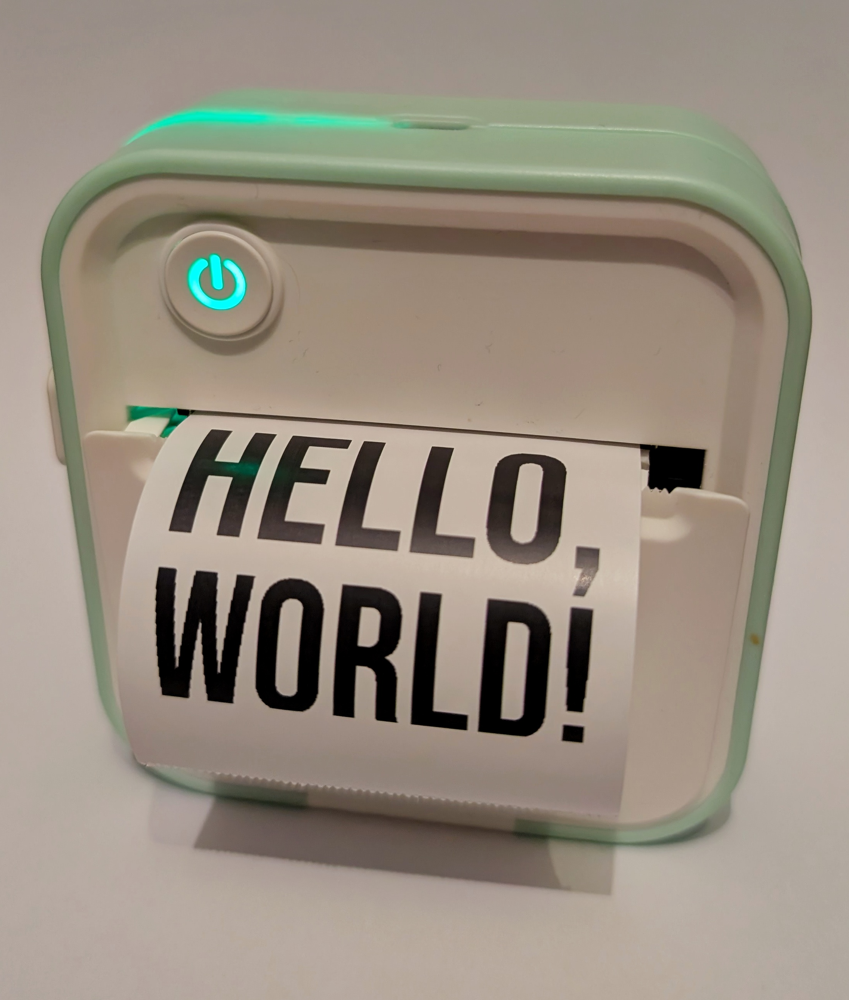

# Paperfeed

A hackable Python driver for 'Funnyprint' (DOLEWA / Xiqi)-branded mini thermal printers.

> This project is currently in early alpha; while I have validated that it works correctly on my printer (DOLEWA D5),
> try it on your own devices at your own risk!

To do this on your own printer, just run `uvx --from git+https://github.com/nathancartlidge/paperfeed demo`!

## Development / Usage
This driver was developed with an assumed Python version of 3.12. However, newer and older versions may also work.

I used `uv` to manage dependencies; if you haven't seen it before, [try it out](https://docs.astral.sh/uv/getting-started/installation/)!
However, it should be a standards-compliant `pyproject.toml`, so `pip install .` should also work fine.

## Acknowledgements
Some driver code was adapted from [printer-driver-funnyprint](https://github.com/ValdikSS/printer-driver-funnyprint/)
by ValdikSS, which exposed a CUPS driver for these printers. I heavily re-used their work in replicating the
function of the packets, particularly in relation to the authentication handshake. This work would not have been
possible (or much more challenging) without their contributions to open source!

This project is [licensed](LICENSE) under GPLv2